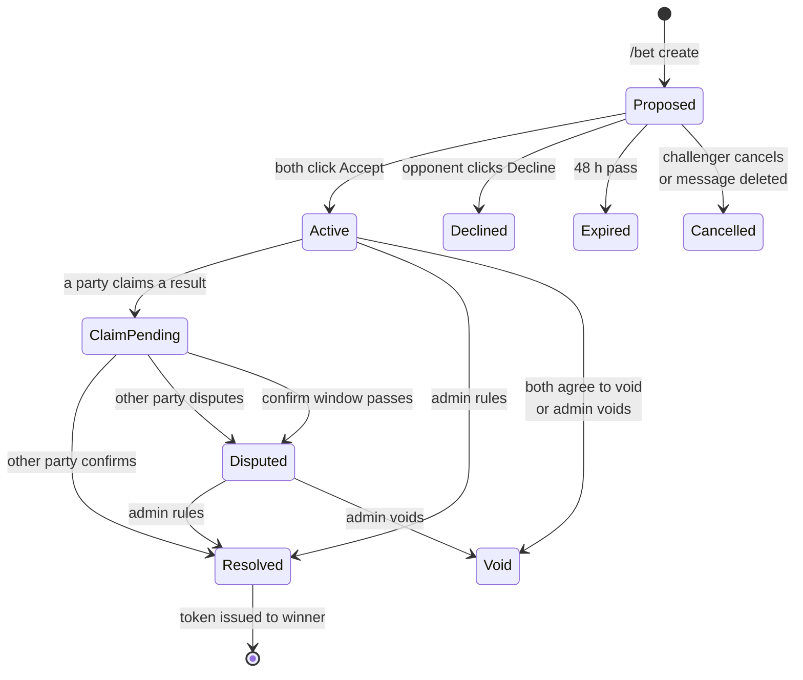
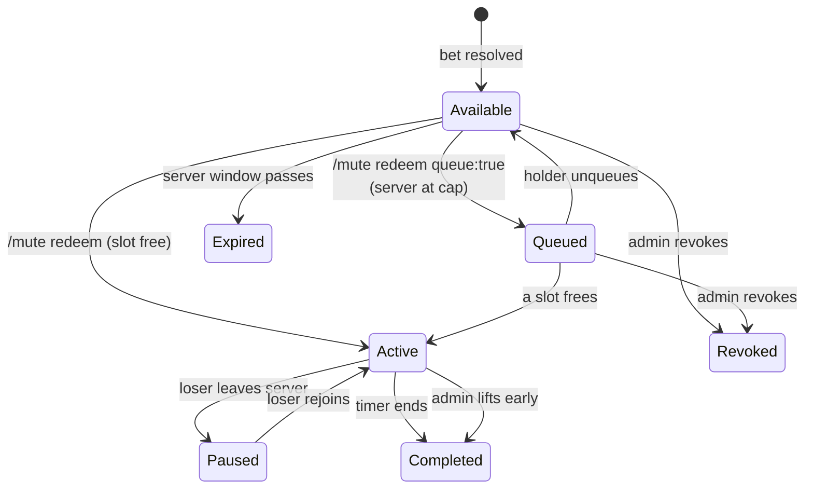
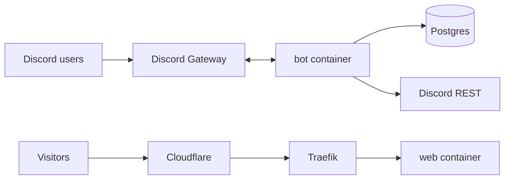

# MuteBetBot — Design Document

Sep 21, 2026 · @Someone

## Overview

MuteBetBot is a public Discord bot where two members wager *time*, not money: the loser of a bet can be muted by the winner for a fixed duration. It ships with a small public website for invites, docs, and legal pages.

**Goals**

- A challenger proposes a bet against another member with a description and a mute duration (30m, 1h, 2h, 6h, 24h).
- The bet becomes binding only when both parties click 🤝 Accept.
- Bets resolve by mutual agreement of both parties, or unilaterally by a server admin.
- The winner receives a *mute token* they can redeem against the loser within a server-configured window (30 days, 1 year, or never expires).
- Redemption applies Discord's native timeout plus a namespaced marker role, and both end exactly on time with no polling loop.
- Admins cap how many members can be bet-muted simultaneously (default 3).

**Non-goals (v1)**

- No currency, points, or real-money wagering.
- No multi-party or pool bets.
- No cross-server tokens: a token only works in the server where it was won.
- No per-channel muting. A mute is server-wide.

## Core concepts and bet lifecycle

There are three records: a **bet** (the agreement), a **mute token** (what the winner earns), and a **mute** (a token being spent). Each has its own state machine, and every transition is a single guarded database update so double-clicks and races can't apply twice.



A resolved bet issues one mute token to the winner, bound to the loser and to the bet's duration. A void bet issues nothing.



**Rules that fall out of this**

- Both parties must click **🤝 Accept** on the proposal, the challenger included. Running `/bet create` alone is not a handshake.
- Proposed bets expire 48 h after creation. This window is system-wide, not configurable.
- Active bets have no time limit. A bet on a month-long season or a year-long prediction just stays Active until someone claims a result.
- A token always targets the bet's loser. The winner chooses *when*, never *who* or *how long*.
- The duration is fixed when the bet is created, so both sides know the stakes before shaking.
- Expiry and duration rules are snapshotted onto the token at issue time. Later config changes don't retroactively alter tokens people already hold. Queued tokens don't expire while they wait.
- Tokens are scoped to one server and are not transferable.

## Slash commands

Slash commands are guild-only. Bets and tokens use short human IDs (e.g. `B7K2`, `T9QX`) with autocomplete, so users rarely type them. Replies about a user's own state are ephemeral; bet proposals, resolutions, and mutes post publicly in the channel or the configured announce channel.

**Member commands**

| Command | Options | Who | Behavior |
| --- | --- | --- | --- |
| `/bet create` | `opponent` (user), `terms` (≤200 chars), `duration` (choice) | Anyone | Posts a public embed with **🤝 Accept**, **Decline**, and **Cancel** buttons. Becomes Active when both parties have clicked Accept. |
| `/bet cancel` | `bet` | Challenger | Proposed bets only (same as the Cancel button). Active bets need `/bet void`. |
| `/bet resolve` | `bet`, `outcome` (I won / They won) | Either party | Opens a claim and DMs the other party to confirm or dispute. |
| `/bet void` | `bet` | Either party | Proposes a no-contest and DMs the other party; takes effect when they confirm. |
| `/bet confirm` | `bet` | The non-claiming party | Accepts the pending claim or void (same as the DM button). |
| `/bet dispute` | `bet`, `reason` (optional) | The non-claiming party | Moves the bet to Disputed and notifies admins. |
| `/bet list` | `user` (optional), `status` (optional) | Anyone | Paginated list, ephemeral. |
| `/bet info` | `bet` | Anyone | Full history of the bet, ephemeral. |
| `/mute tokens` | — | Anyone | Your unspent and queued tokens, with target, duration, and expiry. |
| `/mute redeem` | `token`, `queue` (bool, default false) | Token holder | Mutes the loser now. If the server is at its cap: rejected with the token kept, or with `queue:true`, queued to start the moment a slot frees. |
| `/mute unqueue` | `token` | Token holder | Pulls a queued token back to Available. |
| `/mute status` | — | Anyone | Who is bet-muted right now, when each mute ends, and the queue. |

**DM notifications.** When one party opens a claim or proposes a void, the bot DMs the other party an embed with **Confirm** and **Dispute** buttons. The button's custom ID carries the bet ID, and the handler re-checks everything server-side. If the DM fails (closed DMs, error 50007), the bot pings them in the announce channel instead. DM buttons also work for someone who is currently timed out, since the interaction happens outside the server. The bot also DMs a token holder when their queued mute starts.

**Admin commands** (Manage Server permission, or the configured admin role)

| Command | Options | Behavior |
| --- | --- | --- |
| `/mutebet rule` | `bet`, `winner` or `void` | Resolves or voids any Active or Disputed bet immediately. |
| `/mutebet unmute` | `user` | Ends a bet-mute early: clears the timeout and removes the role. |
| `/mutebet revoke` | `token` | Revokes an unspent token. |
| `/mutebet config view` | — | Shows current settings. |
| `/mutebet config set` | one option per setting | Updates settings (see Server configuration). |
| `/mutebet repair` | — | Recreates the marker role if missing and reports permission and hierarchy problems. |
| `/mutebet uninstall` | `confirm` | Lifts active bet-mutes, deletes the marker role, then leaves the server. |

The `resolve` wording ("I won / They won") avoids asking the caller to pick a user, which removes a whole class of wrong-user mistakes.

## Server configuration

Every setting has a safe default so the bot works the moment it joins. Changes apply to new bets and tokens only; in-flight records keep the values snapshotted when they were created.

| Setting | Default | Allowed values | Notes |
| --- | --- | --- | --- |
| `max_concurrent_mutes` | 3 | 1–25 | Cap on simultaneous bet-mutes. Over the cap, redemptions are rejected with the token kept, unless the holder opts into the queue with queue:true. |
| `token_expiry` | 30 days | 7d, 30d, 90d, 365d, never | Snapshotted onto each token at issue. |
| `allowed_durations` | 30m, 1h, 2h, 6h, 24h | Any subset of those five | Controls the `duration` choices offered by `/bet create`. |
| `confirm_window` | 72 h | 1 h–14 d | Unanswered claims become Disputed. |
| `target_cooldown` | 24 h | 0–7 d | Minimum gap between the end of one bet-mute on a user and the start of the next. |
| `max_open_proposals_per_user` | 3 | 1–10 | Counts Proposed bets only, per user; Active and Disputed bets never use a slot. Throttles spam. |
| `unmutable_members` | honor | honor / reject | Bets involving admins, the owner, or members above the bot's role: allowed as honor mutes, or refused. See Honor mutes. |
| `rejoin_policy` | restart\_full | restart\_full / resume\_remaining | What happens when a bet-muted member leaves and rejoins. See Leaving mid-mute. |
| `admin_role` | none | Any role | Holders get admin commands in addition to Manage Server. |
| `announce_channel` | none (same channel) | Any text channel | Where resolutions, disputes, and mutes are posted. |
| `enabled` | true | true / false | Pauses new bets and redemptions without uninstalling. |

## Muting mechanics

The mute itself is Discord's native timeout, which Discord lifts on its own at the exact end time, even if the bot is offline. Only the cosmetic marker role needs a bot-side timer. That split gives precise unmutes with no polling loop.

**Discord constraints**

- The timeout is set by editing the member's `communication_disabled_until` and needs the Moderate Members permission. It can be at most 28 days ahead, and the API returns 403 if the target is an administrator or the server owner ([twilight docs](https://docs.rs/twilight-http/latest/aarch64-unknown-linux-gnu/src/twilight_http/request/guild/member/update_guild_member.rs.html)). Our 24 h maximum is well inside that.
- The bot can only time out or assign roles to members whose highest role is below the bot's highest role.

**Redemption sequence**

```mermaid
sequenceDiagram
    participant W as Winner
    participant B as Bot
    participant DB as Postgres
    participant D as Discord API
    W->>B: /mute redeem T9QX
    B->>DB: BEGIN; lock guild row;<br/>count active mutes; check cooldown
    B->>D: fetch target member<br/>(present? mutable? existing timeout?)
    B->>DB: token Available→Active,<br/>insert mute(ends_at)
    B->>D: set timeout until ends_at
    B->>D: add marker role
    B->>DB: COMMIT
    B->>B: setTimeout(removeRole, ends_at − now)
    B-->>W: public "@loser muted for 2h"
```

If the timeout call fails, the transaction rolls back and the token stays Available. If only the role call fails, the mute stands and the bot logs a repair warning; the role is cosmetic.

**Scheduling without a tick loop**

- Each active mute gets one in-process `setTimeout` for its `ends_at`. Node caps a single timer at about 24.8 days, which is far above our 24 h ceiling.
- On startup, the bot loads every mute with status Active: overdue ones are finalized immediately (role removed, marked Completed), the rest are rescheduled. The database is the source of truth; timers are just a cache of it.
- Token expiry and claim or acceptance windows don't need precision. They are enforced lazily on read, plus a sweep every 5 minutes that updates statuses and edits the original embeds.

**Concurrency cap**

- The cap is checked inside a transaction holding a row lock on the guild (`SELECT … FOR UPDATE`). Without it, two simultaneous redemptions could both see 2 of 3 and push the server to 4.
- A mute counts toward the cap until its `ends_at` or an admin lifts it. Paused mutes (loser left the server) and honor mutes don't count.
- Over the cap, `/mute redeem` rejects and keeps the token by default. With `queue:true`, the token moves to Queued with a `queued_at` timestamp.
- Whenever a mute ends or is lifted, the same code path that removes the role then takes the guild lock and starts the oldest eligible queued token. A queued token is skipped (and stays queued) if its target is absent, in cooldown, or already muted, so one blocked target can't stall everyone behind it.
- Queued tokens don't expire while waiting. The holder is DM'd when their mute starts, and `/mute unqueue` returns the token to Available.

**Never shorten a moderator's timeout**

- If the target already has a timeout ending later than ours, the bot does not touch it. It still records the bet-mute and adds the role, so the token is spent and the role reflects the bet.
- If an existing timeout ends sooner, the bot extends it to our `ends_at`.
- When a bet-mute ends, the bot only removes the role. It never clears a timeout, because Discord already has, or a moderator's longer one is still running.
- Admin early unmute via `/mutebet unmute` clears the timeout only if the current value still equals the one the bot set.

**Marker role**

- Created as `MuteBetBot · Muted` (the middle dot makes collisions with hand-made roles very unlikely): no permissions, not mentionable, **hoisted** so losers show as their own group in the member list.
- After creation the bot never touches the role's name, color, hoist, or icon. Admins can restyle or un-hoist it in Server Settings, and the bot keeps working because it tracks the role by stored ID, never by name.
- If the stored role is gone, `/mute redeem` recreates it with the defaults before applying.

**Honor mutes (admins and other unmutable members)**

Discord won't let a bot time out administrators, the owner, or anyone above its role, but these members can still bet. When `unmutable_members = honor` (the default), losing one of their bets produces an *honor mute* instead:

- The bot adds the marker role and schedules its removal exactly like a normal mute. No timeout is applied.
- For the duration, the bot watches message-create events from that user in the server. This needs only the non-privileged GuildMessages intent: the bot reads the author and channel, never the message content.
- The first message they send gets a public reply, e.g. "🤐 @Chris lost a bet and is on an honor mute for another 1h 12m." Further callouts are rate-limited to one every 10 minutes per user, so the bot never floods a channel.
- Honor mutes don't count toward `max_concurrent_mutes`, since they don't silence anyone.
- With `unmutable_members = reject`, bets involving these members are refused at `/bet create` as before.

**Leaving mid-mute**

Leaving and rejoining could otherwise dodge a mute, or let it tick down while the person is gone. The bot handles this with the Server Members intent (privileged, see Permissions):

- On member-remove for someone with an Active mute: record the remaining time, set the mute to Paused, and free its cap slot.
- On member-add for someone with a Paused mute: under `restart_full` (default), re-apply the full original duration; under `resume_remaining`, apply what was left. Re-add the role and reschedule. Resumed mutes bypass the cap, since the person already owed the time.
- The bot always writes a fresh timeout on rejoin, so it doesn't depend on whether Discord preserved the old one.

## Permissions and install lifecycle

The bot needs one privileged intent, Server Members, and only for leave/rejoin handling. That's a self-serve toggle until the app reaches 10,000 unique users, after which Discord requires a review; pausing mutes on leave is a clear, defensible use case. Invite scopes are `bot` and `applications.commands`.

| Bot permission | Why |
| --- | --- |
| Moderate Members | Apply and clear timeouts |
| Manage Roles | Create the marker role and add/remove it |
| View Channels, Send Messages, Embed Links | Post bet embeds, announcements, and honor-mute callouts |
| Read Message History | Reply to an honor-muted member's message |
| View Audit Log (optional) | Detect a moderator manually lifting a bet-mute |

| Gateway intent | Privileged? | Why |
| --- | --- | --- |
| Guilds | No | Guild join/leave, roles, channels |
| GuildMessages | No | Message-delete events to cancel proposals; message-create events (author and channel only) for honor-mute callouts |
| GuildMembers | **Yes** | Member leave/rejoin to pause and resume mutes |
| GuildModeration | No | Audit-log events for manual timeout removal (optional) |

Message Content is not needed: bets are created with slash commands, and honor-mute detection only uses who posted. Sending DMs and receiving their button clicks needs no extra intent, since button clicks arrive as interactions.

**Role hierarchy.** A role Discord creates for a bot starts low in the list. The bot can only affect members below its own top role, so on join it posts a setup embed telling admins to drag the bot's role above the roles of members who will bet. `/mutebet repair` re-runs these checks.

**On install (guild create)**

1. Upsert the guild row with default config.
2. Create the marker role (or adopt a stored role ID if it still exists after a reinstall).
3. Post a setup embed in the system channel if writable: current permissions, hierarchy warnings, and a pointer to `/mutebet config`.

**On removal.** Once kicked, the bot has no permissions left, so it *cannot* delete its role. Two consequences:

- `/mutebet uninstall` is the clean path: it lifts active bet-mutes, deletes the marker role, marks the guild uninstalled, then leaves.
- If simply kicked, the orphaned role stays behind and any running timeouts expire naturally within 24 h. The bot soft-deletes the guild's data and purges it after 30 days, so a quick re-add keeps history.

The setup embed and website should both say: "Use `/mutebet uninstall` before removing the bot to clean up its role."

## Data model

Five Postgres tables plus an append-only event log. Discord IDs are stored as `text` (snowflakes overflow JS numbers); all times are `timestamptz` in UTC.

| Table | Key columns | Notes |
| --- | --- | --- |
| `guilds` | `id`, `marker_role_id`, `installed_at`, `removed_at`, config columns from Server configuration | One row per server; row-locked during redemption and queue promotion. |
| `bets` | `id`, `short_id`, `guild_id`, `challenger_id`, `opponent_id`, `terms`, `duration_s`, `status`, `channel_id`, `message_id`, `challenger_accepted_at`, `opponent_accepted_at`, `accept_by` (created + 48 h), `winner_id`, `resolved_by`, `resolved_at` | `short_id` unique per guild. Partial index on Proposed status for the per-user proposal limit. |
| `bet_claims` | `id`, `bet_id`, `claimant_id`, `kind` (win/lose/void), `status`, `respond_by`, `responder_id`, `reason`, `dm_message_id` | At most one open claim per bet (partial unique index). `dm_message_id` lets the bot disable the DM buttons once answered. |
| `tokens` | `id`, `short_id`, `guild_id`, `bet_id`, `holder_id`, `target_id`, `duration_s`, `status`, `issued_at`, `expires_at` (nullable = never), `queued_at` | Statuses: available, queued, active, completed, expired, revoked. Queue order is `queued_at`. |
| `mutes` | `id`, `guild_id`, `token_id`, `target_id`, `kind` (timeout/honor), `starts_at`, `ends_at`, `status` (active/paused/completed), `remaining_s`, `timeout_set_to`, `last_callout_at`, `lifted_by` | `timeout_set_to` records the exact value the bot wrote, so it never clears someone else's timeout. `remaining_s` is set when paused. |
| `events` | `id`, `guild_id`, `entity`, `entity_id`, `actor_id`, `type`, `payload` (jsonb), `at` | Audit trail for `/bet info` and debugging. |

Status transitions are always `UPDATE … SET status = $new WHERE id = $id AND status = $expected`, checking the affected row count. That one pattern handles double-clicks, duplicate reaction events, and the sweep racing a command.

## Edge cases

The biggest risks are a bet that can't be paid out, a mute that overrides a moderator, and harassment loops. Every case below has a defined behavior.

**Creating and accepting bets**

| Case | Handling |
| --- | --- |
| Bet against yourself, a bot, or someone not in the server | Rejected at `/bet create`. |
| Either party can't be timed out (admin, owner, or above the bot's role) | Honor mute by default; refused at create if `unmutable_members = reject`. Checked for **both** parties, since either could lose. |
| Third party clicks Accept, Decline, or Cancel | Ephemeral "this isn't your bet" reply; nothing changes. |
| Opponent declines | Bet goes Declined and the embed's buttons are disabled. |
| Proposal message deleted before acceptance | Bet Cancelled. After acceptance, the bet lives on in the database regardless. |
| Button clicked while the bot is offline | Discord shows "interaction failed"; the user clicks again once the bot is back. On startup the bot re-renders embeds for bets whose state changed while it was down (e.g. expired). |
| `terms` contains `@everyone`, role pings, or invite links | All bot messages use `allowedMentions` restricted to the intended users; terms are length-capped and shown in a quote block. |
| Spam proposals | `max_open_proposals_per_user` (default 3) plus a per-user cooldown on `/bet create` (e.g. 1 per 30 s). |
| Duplicate bet between the same pair on the same terms | Allowed. People genuinely re-bet; the per-user cap limits abuse. |

**Resolving bets**

| Case | Handling |
| --- | --- |
| Both parties claim they won | Second claim is treated as a dispute of the first. Bet goes Disputed and admins are pinged in the announce channel. |
| Claim never answered | After `confirm_window`, bet goes Disputed. It never auto-resolves in the claimant's favor. |
| Other party has DMs closed | Falls back to a ping in the announce channel; they can still use `/bet confirm` or `/bet dispute`. |
| Admin is a party to the bet | Admin commands on their own bet are refused; another admin (or the owner) must rule. |
| The other party is currently timed out when a claim arrives | They answer through the DM buttons, which work outside the server. The confirm window also pauses while either party is bet-muted. |
| Bet about something that never happens | Either party proposes void; admins can void. No token issued. |
| Very long bets (months or a year) | No limit on how long a bet stays Active. They don't count toward the open-proposal limit. |
| A party leaves the server before resolution | Bet stays open. Admins can rule or void. If the leaver would lose, the token is still issued. |

**Redeeming and muting**

| Case | Handling |
| --- | --- |
| Server is at `max_concurrent_mutes` | Rejected with the soonest-ending mute time and the token kept, or queued if the holder passed `queue:true`. |
| Target already bet-muted | Rejected (or queued; the queue skips them until they're free). Stacking would let a few people pile 24 h mutes on one person. |
| Target within `target_cooldown` of their last bet-mute | Rejected with the time they become eligible (or queued). Prevents back-to-back revenge mutes. |
| Queued token whose holder leaves the server | The token stays queued and still fires; the holder just isn't there to see it. |
| Target has a longer moderator timeout | Timeout left alone; see Never shorten a moderator's timeout. |
| Target left the server before redemption | Rejected; token stays Available and works if they rejoin. |
| Target leaves mid-mute | Mute Paused and cap slot freed; re-applied on rejoin per `rejoin_policy`. |
| Target is an admin or above the bot | Honor mute: role plus rate-limited callouts when they post, no timeout. |
| Target promoted to admin between the bet and redemption | Becomes an honor mute (or rejected if `unmutable_members = reject`). Token not spent on rejection. |
| Winner double-clicks redeem | Guarded status update; the second attempt sees the token is no longer Available. |
| Marker role deleted, renamed, or restyled by an admin | Deleted: recreated on the next redemption. Renamed or restyled: left alone; the bot tracks it by ID. |
| Moderator lifts the timeout manually | With audit-log access, the bot marks the mute Completed early, removes the role, and promotes the queue. Without it, the role comes off at the original end time. |
| Bot is down when a mute ends | Discord still lifts the timeout. On startup the bot removes the role and promotes any queued tokens. |
| Discord rate-limits (429) on member edits | The library's REST queue retries; the redemption reply is deferred so it doesn't time out at 3 s. |

**Configuration and lifecycle**

| Case | Handling |
| --- | --- |
| Admin lowers the cap below current active mutes | Running mutes finish; new redemptions wait until the count drops. |
| Admin removes a duration from `allowed_durations` | Existing bets and tokens keep their duration. |
| Admin changes `token_expiry` | Affects tokens issued afterwards only. |
| Bot disabled via `enabled = false` | New bets and redemptions blocked; running mutes and resolutions continue. |
| User requests data deletion | Delete their rows or anonymize them to a tombstone ID; document the process in the privacy policy. |
| Bot grows past 2,500 servers | Sharding becomes mandatory. Each shard reconciles only the mutes for its own guilds on startup. |

## Website and public distribution

v1 website is a small static site: it exists to get the bot invited and to satisfy Discord's verification requirements. No login or dashboard; all config lives in slash commands. It's served from a flexspotff.com subdomain for now, with the base URL in an env var so moving to a dedicated domain later means changing one value plus the Developer Portal links.

| Page | Contents |
| --- | --- |
| `/` | What the bot does in one screen, a 3-step "how a bet works" graphic, and the **Add to Discord** button. |
| `/invite` | Redirects to the OAuth2 URL with scopes `bot applications.commands` and the exact permission integer from Permissions. |
| `/commands` | Every command with options, generated from the same command definitions the bot registers (single source of truth). |
| `/setup` | Role hierarchy instructions with a screenshot, config reference, and the uninstall note. |
| `/privacy` | What is stored (IDs, bet text, timestamps), retention (30 days after removal), and how to request deletion. |
| `/terms` | Acceptable use: bets are for fun, no real-money wagering, admins are responsible for their server. |
| `/support` | Link to a support Discord server and the Forgejo/GitHub issue tracker. |

**Discord requirements**

- App verification is still required once the bot reaches 100 servers; it needs the privacy policy and terms URLs set in the Developer Portal.
- Privileged-intent review is now a separate process triggered at [10,000 unique users rather than 100 servers](https://support-dev.discord.com/hc/en-us/articles/40281523410967-Changes-to-Privileged-Intent-Access-for-Discord-Apps). MuteBetBot uses only the Server Members intent, so it needs that review only after passing 10,000 users.
- Set the Developer Portal's install link to the same URL as `/invite`, and consider an App Directory listing once verified.

**Later (not v1):** a Discord-OAuth dashboard for per-server config and bet history, and a public per-server leaderboard (most bets won, most time muted).

## Tech stack and deployment

Same stack as brackt so nothing new has to be learned or operated: TypeScript on Node, Drizzle + Postgres, Docker behind Traefik, fronted by Cloudflare.

| Layer | Choice |
| --- | --- |
| Language / runtime | TypeScript (strict), Node LTS |
| Discord library | discord.js v14 |
| Database | PostgreSQL + Drizzle ORM, migrations checked in |
| Website | Static build (Astro or React Router 7 prerender), served by the web container |
| Repo layout | pnpm workspace: `apps/bot`, `apps/web`, `packages/db` (schema + queries), `packages/shared` (command definitions, durations, copy) |
| Tests | Vitest; domain logic (state transitions, cap, cooldown, timeout math) is pure and tested without Discord |
| Deploy | Docker Compose: `bot`, `web`, `postgres` (or managed Postgres); Traefik routes the web container |
| CI | Forgejo Actions: typecheck, lint, test, build images, run migrations on deploy |
| Observability | Structured JSON logs (pino); a `/healthz` on the bot reporting gateway status and DB reachability |



The bot needs only an outbound connection, so it can run anywhere; only `web` needs to be publicly reachable. Run exactly one bot process per shard. Two instances on the same token would double-apply reactions and timers.

## Open questions

Nothing is open. Decided in review: both parties click an Accept button; a fixed 48 h acceptance window; optional queueing over the cap; honor mutes for unmutable members; pausing mutes on leave; a hoisted but admin-editable role; no daily mute limit; the open-proposal limit counts Proposed bets only; the website lives on a flexspotff.com subdomain for now. Whether timed-out members can run slash commands is a manual check in build phase 6, and the design handles either answer.

## Claude Code kickoff prompt

Export this doc as Markdown to `docs/DESIGN.md` in a new repo, then paste the prompt below. It builds in phases with a stop after each, so you review before the next layer goes on.

```markdown
You're building MuteBetBot, a public Discord bot plus a small static website.
The full spec is in docs/DESIGN.md. Read it completely before writing code.
Treat it as the source of truth; if something is ambiguous or seems wrong,
ask me instead of guessing. Open questions in the doc are NOT decided —
implement the "current" behavior the doc describes and leave a TODO.

Stack (non-negotiable): TypeScript strict, Node LTS, pnpm workspace,
discord.js v14, PostgreSQL + Drizzle ORM, Vitest, Docker Compose,
Forgejo Actions CI. Layout: apps/bot, apps/web, packages/db, packages/shared.

Architecture rules:
- Domain logic (bet/token/mute state transitions, cap, queue order,
  cooldown, pause/resume and timeout math) lives in pure functions in
  packages/shared or apps/bot/src/domain, with no discord.js imports,
  and is unit-tested.
- Every status change is a guarded UPDATE ... WHERE status = expected and
  checks the affected row count.
- Redemption and queue promotion run in one transaction with
  SELECT ... FOR UPDATE on the guild row, as the sequence diagram shows.
- Unmutes rely on Discord's native timeout. The only timer is a per-mute
  setTimeout for removing the marker role (and promoting the queue),
  rebuilt from the DB on startup. No polling loop for mutes. A 5-minute
  sweep handles expiries and windows only.
- Never shorten or clear a timeout the bot didn't set (store timeout_set_to).
- Proposals use buttons (Accept / Decline / Cancel), not reactions. Both
  parties must click Accept. Proposals expire after a fixed 48 h.
- Claims and voids DM the other party with Confirm / Dispute buttons;
  fall back to a channel ping if the DM fails (error 50007).
- Intents: Guilds, GuildMessages, GuildMembers (privileged, leave/rejoin
  only), GuildModeration. No MessageContent. Honor-mute detection uses
  only author and channel from messageCreate.
- All outgoing messages set allowedMentions to only the intended users.
- Snowflakes are strings. Times are UTC timestamptz.
- Command definitions live in packages/shared and are used both to register
  commands and to generate the website's /commands page.

Build in phases. After each phase: run typecheck, lint, and tests, summarize
what you built and anything you deviated from, then STOP and wait for me.

1. Scaffold: workspace, tsconfig, eslint, Vitest, Docker Compose with
   Postgres, env validation (zod), Forgejo Actions workflow.
2. Database: Drizzle schema for every table in the Data model section,
   indexes and partial unique indexes, first migration, query helpers.
3. Domain: pure state machines and rule checks with thorough tests,
   covering every row of the Edge cases tables that doesn't need Discord.
4. Bot core: client, command registration script (guild-scoped for dev,
   global for prod), guild install/remove handlers, marker role creation,
   setup embed, /mutebet repair.
5. Bets: /bet create with Accept/Decline/Cancel buttons, message-delete
   cancel, resolve, void, confirm, dispute (slash + DM buttons), list,
   info, autocomplete for bet IDs.
6. Tokens & mutes: /mute tokens, redeem (with queue option), unqueue,
   status; scheduler and queue promotion; startup reconciliation;
   honor mutes with rate-limited callouts; pause on leave and resume on
   rejoin per rejoin_policy; audit-log detection of manual unmutes.
   Manually check whether a timed-out member can run slash commands in
   the server and report the result (the design handles either answer).
7. Admin: /mutebet rule, unmute, revoke, config view/set, uninstall.
8. Website: static site with the pages listed in the doc, invite redirect
   built from the shared permission constant, Dockerfile for Traefik.
   Base URL comes from an env var (a flexspotff.com subdomain for now).

Start with phase 1.
```

## Sources

- [twilight-http: Update Guild Member (timeout limits and 403 behavior)](https://docs.rs/twilight-http/latest/aarch64-unknown-linux-gnu/src/twilight_http/request/guild/member/update_guild_member.rs.html)
- [Discord: Changes to Privileged Intent Access for Discord Apps (June 2026)](https://support-dev.discord.com/hc/en-us/articles/40281523410967-Changes-to-Privileged-Intent-Access-for-Discord-Apps)
